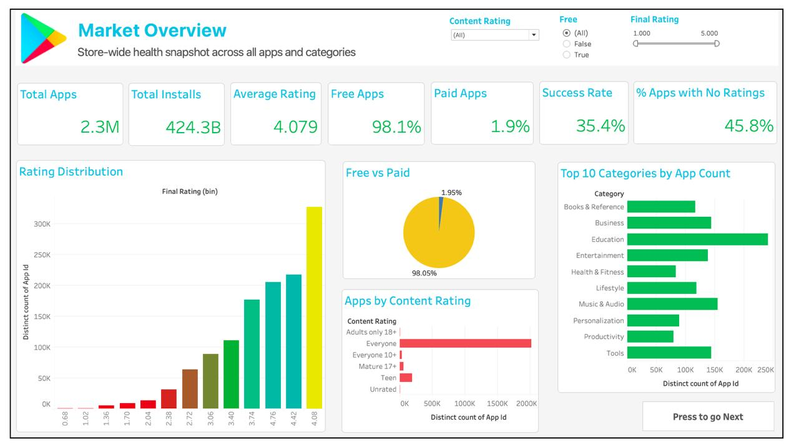
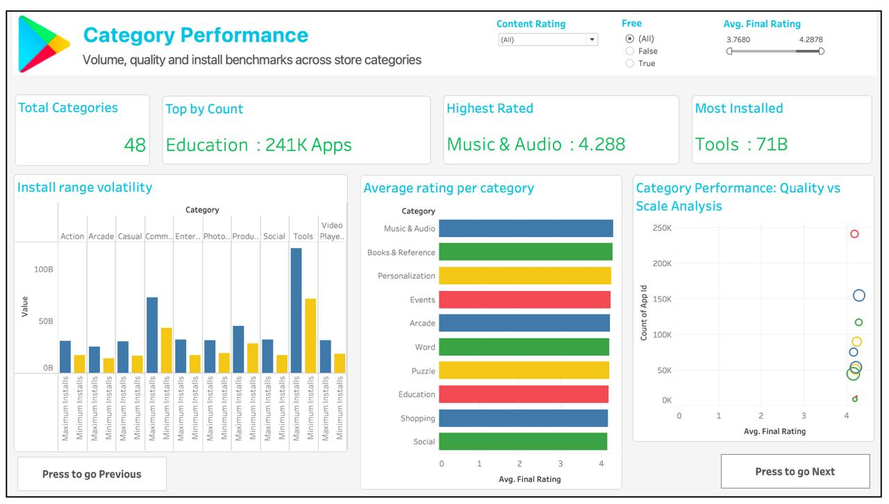
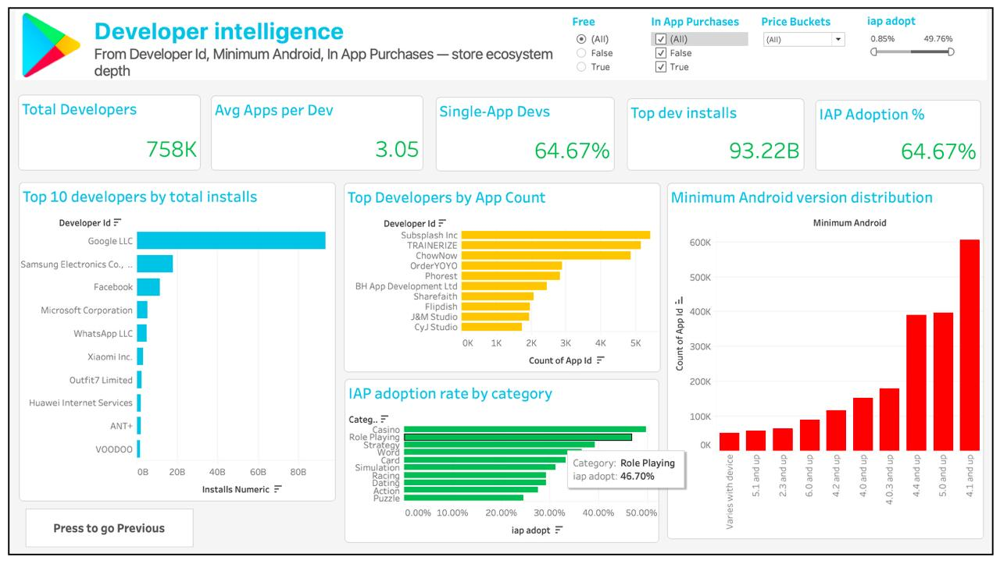
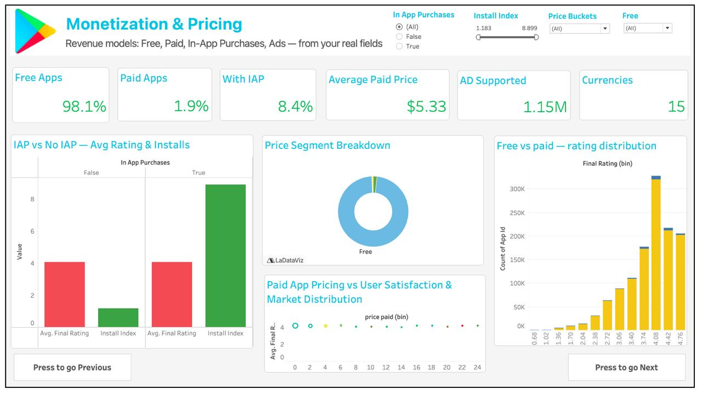

# Google Play Store Ecosystem Analytics (Tableau)

Tableu Public link : https://public.tableau.com/views/GooglePlayStoreAppsAnalysisDashboard/Dashboard2?:language=en-GB&:sid=&:redirect=auth&:display_count=n&:origin=viz_share_link

## Objective (Google’s Perspective)
This dashboard analyzes the Google Play Store ecosystem from a **platform strategy perspective**.

The goal is to help Google:
- Improve **developer ecosystem health**
- Optimize **monetization models (IAP vs Paid)**
- Identify **engagement gaps**
- Support **high-growth categories and developers**

---

# Dashboard Structure (4 Pages)

---

## 1. Market Overview — Platform Health Snapshot

###  Key Findings:
- Total Apps: **2.3M**
- Total Installs: **424B+**
- Avg Rating: **~4.08**
- Free Apps: **98.1%**
- Paid Apps: **1.9%**
- Apps with No Ratings: **45.8%**

###  Google-Level Insights:
- The ecosystem is **heavily skewed toward free apps**, confirming dominance of the freemium model
- Nearly **half the apps lack ratings**, indicating:
  - Low user engagement
  - Poor discoverability
- Ratings are clustered around high values → possible **rating inflation / bias**

###  Strategic Implications:
- Improve **user feedback systems** (nudges for ratings)
- Enhance **app discovery algorithms**
- Support quality differentiation beyond ratings

---

## 2. Category Performance — Supply vs Quality vs Demand

###  Key Findings:
-  Highest volume: **Education (~241K apps)**
-  Highest rating: **Music & Audio (~4.29)**
-  Highest installs: **Tools (~71B installs)**

###  Google-Level Insights:
- **Category imbalance exists**:
  - Some categories dominate supply (Education)
  - Others dominate demand (Tools)
- High rating ≠ high installs → **quality doesn’t always drive scale**

###  Strategic Implications:
- Promote **high-quality but under-discovered categories**
- Optimize **category ranking algorithms**
- Encourage developers in **high-demand, low-supply segments**

---

##  3. Developer Intelligence — Ecosystem Structure

###  Key Findings:
-  Developers: **758K**
-  Avg apps/dev: **3.05**
-  Single-app devs: **64.67%**
-  Top developer installs: **93B+**
-  IAP adoption: **~64%**

###  Google-Level Insights:
- Strong **long-tail ecosystem**:
  - Majority developers publish only 1 app
  - A small group dominates installs
- Ecosystem follows a **power-law distribution**
- IAP adoption is high → strong monetization maturity

###  Strategic Implications:
- Provide tools to help **small developers scale**
- Incentivize **multi-app development**
- Support top developers while ensuring **ecosystem fairness**

---

##  4. Monetization & Pricing — Revenue Strategy

###  Key Findings:
- Free Apps: **98.1%**
- Paid Apps: **1.9%**
- Apps with IAP: **8.4%**
- Avg Paid Price: **$5.33**

### Google-Level Insights:
- The platform is clearly **freemium-driven**
- Direct paid apps are almost negligible
- IAP is the **primary monetization channel**
- Price has **minimal impact on ratings**

### Strategic Implications:
- Focus on improving **IAP ecosystem (billing, UX, trust)**
- Encourage developers to adopt **hybrid monetization models**
- De-emphasize paid-only strategies

---

# Cross-Metric Insights

### Correlation Summary:
- Rating ↔ Installs → Moderate positive  
- Rating Count ↔ Installs → Strong positive  
- Price ↔ Rating → No relationship  

### Interpretation:
- Engagement (ratings count) is a stronger growth driver than rating score
- Pricing does not influence user satisfaction significantly

---

# Key Strategic Takeaways for Google

- Play Store is a **freemium-first ecosystem**
- Developer success is **highly concentrated**
- Engagement gap (no ratings) is a major concern
- IAP is the **future of monetization**
- Discovery and recommendation systems are critical levers

---

# Tools & Techniques

- Tableau Desktop  
- LOD Calculations  
- KPI Cards & Interactive Filters  
- SPLOM (Scatter Plot Matrix)  
- Distribution & Segmentation Analysis  

---

# Conclusion

This dashboard provides a **platform-level view of the Play Store**, helping Google:

- Strengthen developer ecosystem  
- Improve user engagement  
- Optimize monetization strategy  
- Drive sustainable marketplace growth  

---

# Usage

- Use filters (Free, Content Rating, Price Buckets)
- Navigate using dashboard buttons
- Hover for detailed insights

